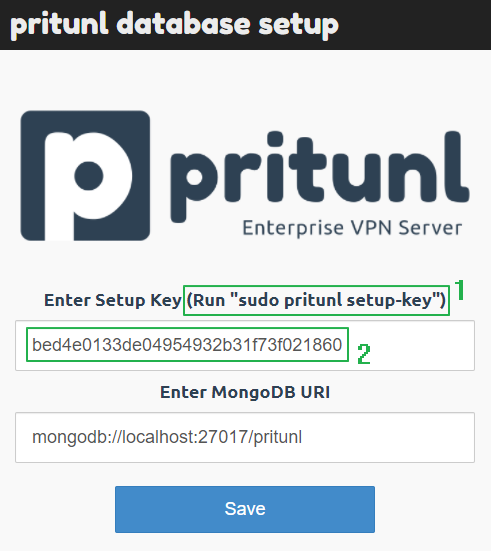
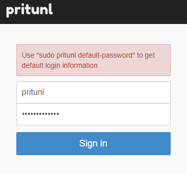

## 1. Обновляем систему

```sh
sudo apt update -y
```

Также устанавливаем необходимые пакеты

```sh
sudo apt install wget vim curl gnupg2 software-properties-common apt-transport-https ca-certificates lsb-release -y
```

## 2. Устанавливаем Pritunl VPN server
#### A. Добавляем Pritunl и MongoDB репозитории и публичные ключи

Now add the Pritunl repository on Ubuntu 22.04.

```sh
sudo tee /etc/apt/sources.list.d/pritunl.list << EOF
deb https://repo.pritunl.com/stable/apt jammy main
EOF
```

Добавляем GPG ключи для репозитория:

```sh
sudo apt-key adv --keyserver hkp://keyserver.ubuntu.com --recv 7568D9BB55FF9E5287D586017AE645C0CF8E292A
```

Добавляем MongoDB репозиторий на Ubuntu 22.04.

```sh
curl -fsSL https://www.mongodb.org/static/pgp/server-6.0.asc|sudo gpg --dearmor -o /etc/apt/trusted.gpg.d/mongodb-6.gpg
```
```sh
echo "deb [ arch=amd64,arm64 ] https://repo.mongodb.org/apt/ubuntu jammy/mongodb-org/6.0 multiverse" | sudo tee /etc/apt/sources.list.d/mongodb-org-6.0.list
```

#### B. Устанавливаем Pritunl и MongoDB

Используя добавленные выше репозитории, мы с лёгкостью установим Pritunl и MongoDB на Ubuntu 22.04. Команда ниже поможет нам в этом:

```sh
sudo apt update && sudo apt install pritunl mongodb-org -y
```

Когда установка завершится, запустим и активируем Pritunl и MongoDB сервисы:

```sh
sudo systemctl restart pritunl mongod
```
```sh
sudo systemctl enable pritunl mongod
```

Проверим статусы сервисов:

```sh
systemctl status pritunl mongod
```
```sh
● pritunl.service - Pritunl Daemon
     Loaded: loaded (/etc/systemd/system/pritunl.service; enabled; vendor preset: enabled)
     Active: active (running) since Tue 2023-08-29 12:49:27 UTC; 9s ago
   Main PID: 13552 (pritunl)
      Tasks: 20 (limit: 4523)
     Memory: 83.9M
        CPU: 1.754s
     CGroup: /system.slice/pritunl.service
             ├─13552 /usr/lib/pritunl/usr/bin/python3 /usr/lib/pritunl/usr/bin/pritunl start
             └─13646 pritunl-web

Aug 29 12:49:27 jammy systemd[1]: Started Pritunl Daemon.

● mongod.service - MongoDB Database Server
     Loaded: loaded (/lib/systemd/system/mongod.service; enabled; vendor preset: enabled)
     Active: active (running) since Tue 2023-08-29 12:49:27 UTC; 9s ago
       Docs: https://docs.mongodb.org/manual
   Main PID: 13553 (mongod)
     Memory: 68.0M
        CPU: 888ms
     CGroup: /system.slice/mongod.service
             └─13553 /usr/bin/mongod --config /etc/mongod.conf

Aug 29 12:49:27 jammy systemd[1]: Started MongoDB Database Server.
Aug 29 12:49:28 jammy mongod[13553]: {"t":{"$date":"2023-08-29T12:49:28.002Z"},"s":"I",  "c":"CONTROL",  "id":7484500, "ctx":"-","msg":"Environment variable MONGODB_CONFIG_OVERRIDE_NOFORK == 1, ove>
```
## 3. Конфигурация Pritunl VPN сервера

Pritunl VPN сервер конфигурируется через web-интерфейс, который располагается по адресу `https://<your-server-ip>`

Прежде чем начать, получим аутентификационный ключ для MongoDB

```sh
sudo pritunl setup-key
```


Сгенерируем пару логин/пароль:

```sh
sudo pritunl default-password
```

Зайдем еще раз на сервер по IP:


После авторизации появляется окно с глобальными настройками сервера, в котором можно отредактировать логин и пароль для доступа, ip-адреса сервера, изменить порт на котором будет работать панель, а также можно указать домен, для автоматического получения сертификата Let's Encrypt.

![[src/Pasted image 20231123134818.png]]

Чтобы начать пользоваться Pritunl нужно:
1. Создать организацию
2. Создать сервер Pritunl
3. Прикрепить сервер к организации
4. Создать пользователя и прикрепить его к организации
5. Скачать конфиг файл нашего пользователя

### Создание организации

Перейдем во вкладку `Users` → `Add Organization` и добавим новую организацию:
![[src/Pasted image 20231123135219.png]]

Видим только что созданную организацию
![[src/Pasted image 20231123135953.png]]
### Создание сервера

Чтобы создать сервер, перейдем во вкладку `Servers` → `Add Server` и активируем вкладку `Advanced`, чтобы увидеть все возможные настройки, я оставил всё по умолчанию:

![[src/Pasted image 20231123135432.png]]

Добавим сервер.

Прикрепим серверу к организацию. Для этого нажмём `Attach Organization`:

![[src/Pasted image 20231123135720.png]]

Нажмем на кнопку `Start Server` для запуска сервера.

Видим наш новый VPN сервер
![[src/Pasted image 20231123140051.png]]

### Создание пользователя

Чтобы создать пользователя, перейдем во вкладку `Users` → `Add User`:

![[src/Pasted image 20231123135906.png]]

### Раздаем ключи

Чтобы подключиться к VPN, скачаем и установим клиент, который поддерживает OpenVPN протокол, для своей ОС. Вернемся к серверу и перейдем во вкладку `Users`, и кликнем по кнопке `download` возле нашего нового пользователя:

![[src/Pasted image 20231123140909.png]]

Скачается tar архив, внутри которого будет конфигурационный файл OpenVPN, для подключения к нашему VPN
![[src/Pasted image 20231123140948.png]]

Импортируйте этот файл в ваш VPN приложение и наслаждайтесь своим творением.
